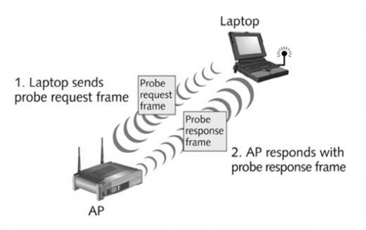
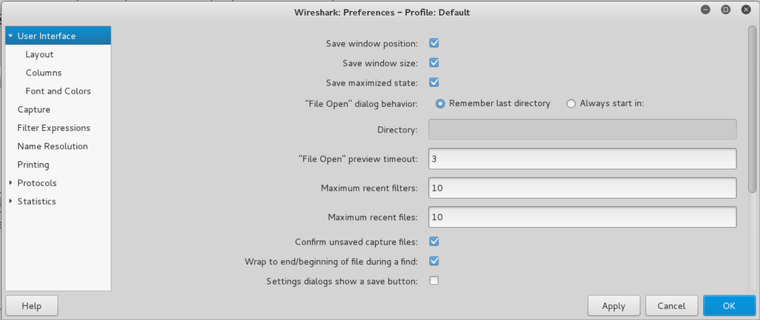
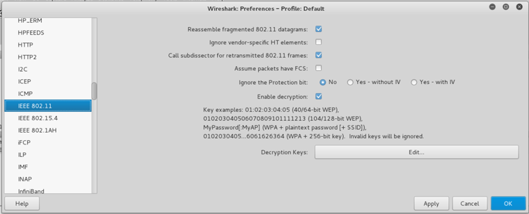
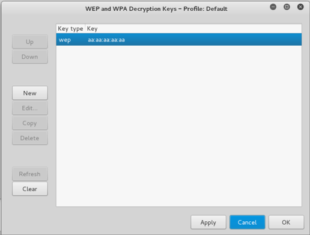

# Teaching-HEIGVD-SRX-2020-Laboratoire-WiFi

Vous aurez besoin de ``Wireshark`` et du logiciel ``aircrack-ng`` pour ce laboratoire. 

Si vous utilisez une distribution Kali, tout est déjà pré-installé. Pour la version Windows du logiciel ``aircrack-ng``ou pour son installation sur d'autres distributions, référez-vous au
[site web aircrack-ng](https://aircrack-ng.org) et/ou au gestionnaire de paquets de votre distribution.
 
# Identification d'un dispositif

## Introduction

L’objectif de cette partie est de vous familiariser avec les captures provenant de l’interception de données sans fils et de comprendre quels types d’informations utiles peuvent être obtenues à partir des dites captures.

Comme vous l’avez étudié dans le cours théorique, l’environnement le plus adapté et riche pour capturer et analyser/exploiter les données des réseaux sans-fils est Linux. Pourtant, une machine Windows peut être utilisée avec ``Wireshark`` pour analyser du trafic déjà capturé par d’autres moyens. L’outil le plus utilisé pour le craquage de réseaux sans fils, la suite ``aircrack``, est aussi disponible sur Windows. Malgré les limitations imposées par la carence de drivers en mode monitor pour Windows pour capturer le trafic nécessaire, ``aircrack`` peut être utilisé pour analyser des captures faites par d’autres moyens et obtenir les clés WEP ou les passphrases WPA.

L’une des informations de plus intéressantes et utiles que l’on peut obtenir à partir d’un client sans fils de manière entièrement passive (et en clair) se trouve dans la trame ``Probe Request`` :



Dans ce type de trame, utilisée par les clients pour la recherche active de réseaux, on peut retrouver :

* L’adresse physique (MAC) du client (sauf pour dispositifs iOS 8 ou plus récents et les versions les plus récentes d'Android…). 
	* Utilisant l’adresse physique, on peut faire une hypothèse sur le constructeur du dispositif sans fils utilisé par la cible.
	* Elle peut aussi être utilisée pour identifier la présence de ce même dispositif à des différents endroits géographiques où l’on fait des captures, même si le client ne se connecte pas à un réseau sans fils.
* Des noms de réseaux (SSID) recherchés par le client.
	* Un Probe Request peut être utilisé pour « tracer » les pas d’un client. Si une trame Probe Request annonce le nom du réseau d’un hôtel en particulier, par exemple, ceci est une bonne indication que le client s’est déjà connecté au dit réseau. 
	* Un Probe Request peut être utilisé pour proposer un réseau « evil twin » à la cible.

## Travail à réaliser

Nous allons utiliser une capture Wireshark pour essayer de déterminer si une cible se trouvait présente à l’HEIG-VD, lieu où une capture devant être analysée, à été faite.

Nous savons que la cible s’est hébergée à l’hôtel « Black Rain » et qu’elle a aussi visité un Starbucks où elle s’est peut-être servie du Wi-Fi gratuit.

### Exercice :

* Copier [le fichier de capture](files/coursWLAN-IdentifyTarget.pcap) sur votre machine locale
* Ouvrir le fichier avec Wireshark
* Analyser la capture pour déterminer l’adresse MAC du dispositif de la cible
* Utiliser un filtre d’affichage Wireshark pour montrer uniquement les trames du type ``Probe Request`` 
* Répondre aux questions suivantes :

> **_Question :_** Quel filtre avez-vous utilisé
> 
> **_Réponse :_** wlan.fc.type_subtype==4
> 

---
> **_Question :_** Quel est l’adresse MAC de la cible ?
> 
> **_Réponse :_** Nous savons que la cible s'est rendu dans l'hôtel Black Rain et un Starbucks. Nous allons alors chercher dans les SSID ceux qui s'en rapprochent le plus.
> 
> Black Rain:
> 
> 
> Starbucks:
> 
> 
> L'adresse MAC de la cible semble donc être FC:F1:36:22:49:74.

---
> **_Question :_** Quel est le nom du constructeur de l’interface sans fils de la cible ?
> 
> **_Réponse :_** Selon la capture Wireshark disponible, la cible utilise un laptop ou smartphone avec une interface provenant de la société Samsung.
> 

---
> **_Question :_** Quel autres endroits la cible a-t-elle probablement visités ?
> 
> **_Réponse :_** 
> La cible semblerait avoir visité l'aéroport de Genève, une Migros et une boutique de Fleur de Pains.

---

# Réseaux protégés par WEP

## Introduction

La norme originale 802.11 spécifie WEP comme étant une méthode pour gérer l’accès au réseau (authentification) et pour la confidentialité de données (chiffrement). 

Bien que trouvée faible et exploitée depuis de nombreuses années, cette méthode continue à être utilisée dans beaucoup de pays. Elle est toujours très répandue dans plusieurs zones du tiers monde, mais on retrouve avec étonnement des réseaux WEP aux USA et dans des pays de l’Europe et l'Asie.

## Travail à réaliser

Nous allons nous servir de l’outil ``aircrack-ng`` pour retrouver la clé de chiffrement WEP utilisée pour protéger un réseau dont nous avons une capture avec assez de trafic pour cracker la clé. Une fois la clé récupérée, nous l’utiliserons Wireshark pour rendre la capture lisible.

### Exercice :

* Copier [la capture chiffrée avec WEP](files/coursWLAN-WEP.cap)
* Ouvrir le fichier avec Wireshark et essayer de lire son contenu. Utiliser des filtres d’affichage de protocoles connus (http, icmp). Est-ce que vous arrivez à trouver des trames contenant ces protocoles ? (normalement pas puisque le contenu est chiffré !)
* Utiliser ``aircrack-ng`` pour récupérer la clé de chiffrement du réseau WEP. Si vous utilisez une distribution Kali, aircrack est déjà installé. Sinon, renseignez-vous sur Internet pour l'installer sur votre système.

```
aircrack-ng <nom-du-fichier-capture>
```

Maintenant que vous avez la clé WEP, configurez la dans Wireshark afin de déchiffrer le trafic (en fonction de la version de Wireshark, ces images peuvent varier légèrement) :

* Ouvrir les préférences de Wireshark et localiser l’option « Protocols »



* Dans « Protocols », trouver le protocol IEEE 802.11. Activer l’option « Enable decryption » et ensuite cliquer sur le bouton « Edit » de la fenêtre pour ajouter une nouvelle clé WEP



* Cliquer sur « New » et entrer la nouvelle clé WEP que vous avez trouvée avec ``aircrack``. Puis, accepter :



* Essayez à nouveau de lire le contenu de la capture. Utilisez encore une fois des filtres de protocoles connus (http, icmp). Est-ce que vous arrivez à trouver des trames contenant ces protocoles cette fois-ci ?

* Répondre aux questions suivantes :

> **_Question :_** Combien de temps avez-vous attendu pour obtenir la clé WEP ?
> 
> **_Réponse :_** moins d'une seconde

---
> **_Montrer une capture d'écran de l'obtention de la clé WEP_**
> 
> **_Capture ici_** 

---
> **_Question :_** Arrivez-vous à récupérer les informations d’identification (credentials) de l’authentification basique http contenue dans la capture ?
> 
> **_Réponse :_** 
> Les informations d'identification sont admin:admin .

---


# Réseaux protégés par WPA

## Introduction

La réponse aux problèmes de sécurité de WEP est arrivée sous la forme d’une couche supplémentaire (protocole TKIP) utilisant toujours le moteur de chiffrement de WEP mais le rendant beaucoup plus fort. Un peu plus tard, la norme 802.11i spécifie la nouvelle méthode WPA2, utilisant AES pour le chiffrement et le contrôle de l’intégrité des messages.

Malgré le fait que ces protocoles sont très performants, ils sont vulnérables à des attaques par dictionnaire, à condition de capturer l’authentification d’un utilisateur légitime.

Vous allez exploiter cette faille dans la partie suivante en utilisant la suite aircrack pour trouver une passphrase WPA-PSK.

## Travail à réaliser

### Exercice Authentification :

Nous utiliserons Wireshark pour trouver l’authentification WPA contenue dans le 4-way handshake.

* Copier [le fichier de capture chiffré avec WPA](files/coursWLAN-WPA.cap) sur votre machine
* Utiliser Wireshark pour identifier les 4 messages échangés au moment de l’authentification WPA. Vous pouvez utiliser le filtre d’affichage suivant ``eapol`` de Wireshark
* Analyser les messages du 4-way handshake. En particulier, essayer de trouver les chiffres aléatoires (Nonces) échangés entre le client et l’AP.

> **_Fournir une capture d'écran des chiffres aléatoires_**
> 
> **_Capture ici_**  
> 1er message (60cb806f531978f2b6b18d1cad6855e592333764791225fa89ac74e60d12d971): 
> 
> 2eme message (72f64cc60d16d2c6f6e61c3ea6a3961f2a9651324918d26f709c48a0e00c51d3): 
> 
> 3eme message (60cb806f531978f2b6b18d1cad6855e592333764791225fa89ac74e60d12d971):  
> 
> 4eme message (72f64cc60d16d2c6f6e61c3ea6a3961f2a9651324918d26f709c48a0e00c51d3):  
> 

---


### Exercice déchiffrement WPA :

Nous allons nous servir de l’outil aircrack-ng et d’un dictionnaire pour retrouver la passphrase utilisée pour protéger un réseau dont nous avons une capture. Une fois la passphrase récupérée, nous l’utiliserons dans Wireshark pour rendre la capture lisible.

* Copier [le dictionnaire](files/french_dico.txt) sur votre machine locale 
* Utilisez aircrack-ng en ligne de commandes pour cracker la passphrase du réseau WPA avec le même [fichier de capture chiffrée avec WPA](files/coursWLAN-WPA.cap) que vous avez déjà copié.
 
```
aircrack-ng <nom-du-fichier-capture> -w <nom-du-dictionnaire>
```

* Configurer la passphrase WPA dans Wireshark afin de déchiffrer le trafic (utiliser les exemples de la partie WEP comme guide. Sélectionnez « wpa-pwd » comme type de clé)

* Répondre aux questions suivantes :

> **_Question :_** Combien de temps avez-vous attendu pour obtenir la passphrase WPA ?
> 
> **_Réponse :_** 1 minute et 30 secondes environ

---
> **_Montrer une capture d'écran de l'obtention de la passphrase WPA_**
> 
> **_Capture ici_** 

---
> **_Question :_** Lors de la capture, la cible a fait un « ping » sur un serveur. Arrivez-vous à dire de quel serveur il s’agit ?

> 
> **_Réponse :_** 
> 
> 
> Adresse IP du serveur :  
> 31.13.64.35
>
> Nom de Domaine :  
> edge-star-mini-shv-01-amt2.facebook.com
> 
> 


### Exercice déchiffrement WPA 2 :

Nous avons enlevé une seule trame (choisie stratégiquement) du fichier de capture original chiffré avec WPA. On vous demande d'essayer de refaire l’exercice précédent mais avec [ce nouveau fichier de capture](files/coursWLAN-WPA-filtered.cap) utilisant donc [le même dictionnaire](files/french_dico.txt).

* Répondre aux questions suivantes :

> **_Question :_** Est-ce que vous arrivez à refaire l'exercice ? Pourquoi ou pourquoi pas ?
> 
> **_Réponse :_** Non car aircrack-ng n'arrive pas à obtenir le packet utile pour le décodage de la clé WPA.  
> 

---
> **_Question :_** Sur la base de votre réponse précédente, arrivez-vous à déduire quelle trame a été effacée ?
> 
> **_Réponse :_** La seconde trame lors du 4-way handshake semble manqué car c'est cette trame qui donne à l'AP la clé KEK pour l'encryption de données (et donc sa décryption). Et aircrack-ng a besoin des packets 2 et 3 pour fonctionner.
> 